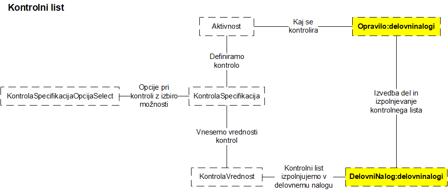

.. _django:

DJANGO - Wasco
===================
===================

UPORABNO PRI FORMS
####################

Prenos podatkov preko "KWARGS"
*******************************

    v get_context_data(self, *args, **kwargs):
        context = super(StrosekCreateView, self).get_context_data(*args, **kwargs)

        # strosek
        context['strosek_osnova_create_form'] = StrosekOsnovaCreateForm

        racun = Racun.objects.get(id=self.get_object().id)
        davcna_klasifikacija = racun.davcna_klasifikacija
        context['vrsta_stroska_izbira_form'] = VrstaStroskaIzbiraForm(davcna_klasifikacija=davcna_klasifikacija)

        # zavihek
        modul_zavihek = Zavihek.objects.get(oznaka="STROSEK_CREATE")
        context['modul_zavihek'] = modul_zavihek

Factory Boy
###########

Generiranje podatkov za bazo pri testiranju.

Osnovna dokumentacija:
https://media.readthedocs.org/pdf/factoryboy/latest/factoryboy.pdf
http://factoryboy.readthedocs.io/en/latest/recipes.html

Osnova za generiranje podatkov
******************************

.. code-block:: Python

    import factory

    class AktivnostFactory(factory.Factory):
        class Meta:
            model = AktivnostFactory

        naziv = 'Moj prvi factory za aktivnost'

Izdelava enega podatka
**********************

.. code-block:: python

    # izdelamo aktivnost iz factory boya
    aktivnost = AktivnostFactory.create()

    # aktivnost shranimo v bazo
    aktivnost.save()

Izdelava več podatkov
*********************

.. code-block:: none

    aktivnost_list = AktivnostFactory.build_batch(2)

Selenium
########

Install geckodriver
*******************

* https://askubuntu.com/questions/870530/how-to-install-geckodriver-in-ubuntu

Transactions modul
##################

from django.db import transaction
with transaction.atomic():
    do somethin with database

če je karkoli narobe se vse kar je napisano v transaction.atomic() povrne v prvotno stanje

Lahko uporabimo tudi dekorator:

.. code-block:: python

    @transaction.atomic
    def viewfunc(request):
        # This code executes inside a transaction.
        do_stuff()

FORMSETS
########

Zunanji viri
************

* http://whoisnicoleharris.com/2015/01/06/implementing-django-formsets.html
* http://bitofpixels.com/blog/form-and-formset-in-one-html-form/
* https://github.com/AndrewIngram/django-extra-views/blob/master/extra_views_tests/tests.py

Formset input data
******************

data = {
    'oznaka': 'OZNAKA',
    'naziv': 'NAZIV',
    'kontrolaspecifikacija_set-TOTAL_FORMS': 1,
    'kontrolaspecifikacija_set-INITIAL_FORMS': 0,
    'kontrolaspecifikacija_set-0-oznaka': 'KS_0',
    'kontrolaspecifikacija_set-0-naziv': 'A1',
    'kontrolaspecifikacija_set-0-opis': 'ass',
    'kontrolaspecifikacija_set-0-vrednost_vrsta': 1,
}

response = self.client.post(url, data)

.. glossary::

    'form_set-TOTAL_FORMS': 1
        Prikaže koliko forme, ki se jih izpolnjuje

    'form_set-INITIAL_FORMS': 0
    	Prikaže že obstoječe forme, ki se jih updata
        Specificirati moraš še 'form_set-0-id': instanca.id

CONCATENATE QUERYSETS
#####################

* https://chriskief.com/2015/01/12/combine-2-django-querysets-from-different-models/
* https://simpleisbetterthancomplex.com/tips/2016/06/20/django-tip-5-how-to-merge-querysets.html
* https://stackoverflow.com/questions/34042961/when-i-tried-to-sort-a-list-i-got-an-error-dict-object-has-no-attribute
